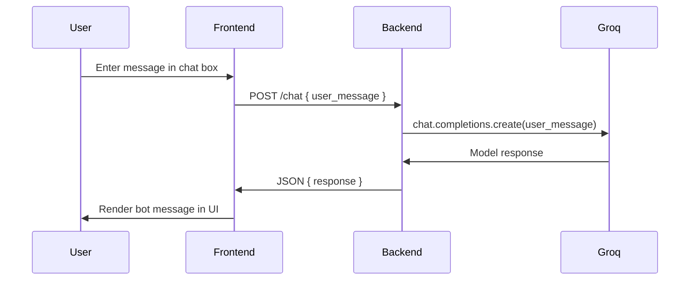

#  **Basic Chatbot (Full-Stack Chatbot Boilerplate — FastAPI + JavaScript UI)**

A minimal full-stack chatbot starter template with a **FastAPI backend** (powered by Groq's hosted LLMs) and a **React + Vite frontend**.
The backend exposes a simple `/chat` API, and the frontend provides a clean chat interface for interacting with the bot. Lightweight, extendable, and perfect for swapping in other LLMs, RAG systems, or NLP pipelines.

**Live Demo:** [https://basic-chatbot-xi.vercel.app](https://basic-chatbot-xi.vercel.app)


---

# **Repository Folder Structure**

```
Basic-Chatbot/
│
├── chatbot-backend/
│   ├── main.py              # FastAPI app defining /chat endpoint
│   ├── requirements.txt     # Python dependencies
│   └── __pycache__/         
│
├── chatbot-frontend/
│   ├── public/              # Static assets
│   ├── src/                 # React components, CSS, image assets
│   │   ├── App.jsx          # Main chat UI component
│   │   ├── App.css
│   │   ├── index.css
│   │   └── main.jsx         # React entry point
│   ├── index.html           # HTML shell
│   ├── package.json
│   └── package-lock.json
│
├── README.md                # Documentation
└── .gitignore
```

---

# **How to Run the Project Locally**

---

# **1️⃣ Backend (FastAPI)**

### **Install dependencies**

```bash
cd chatbot-backend
pip install -r requirements.txt
```

### **Configure environment**

Create a `.env` file inside `chatbot-backend/`:

```
GROQ_API_KEY=your_groq_api_key_here
```

Get a free key from [Groq Console](https://console.groq.com/keys).

### **Run the FastAPI server**

```bash
uvicorn main:app --reload
```

Backend will run on:

```
http://127.0.0.1:8000
```

### **Test the API**

```bash
curl -X POST "http://127.0.0.1:8000/chat" \
    -H "Content-Type: application/json" \
    -d '{"user_message": "hello"}'
```

---

# **2️⃣ Frontend (React + Vite)**

### **Start the frontend**

```bash
cd chatbot-frontend
npm install
npm run dev
```

The dev server runs on `http://localhost:5173`.

### **Configure frontend API**

The frontend reads `VITE_API_BASE_URL` from the environment and falls back to
`http://localhost:8000`. To point at a different backend, create
`chatbot-frontend/.env`:

```
VITE_API_BASE_URL=http://127.0.0.1:8000
```

The base URL is used in `src/App.jsx`:

```js
const API_BASE_URL =
  import.meta.env.VITE_API_BASE_URL || "http://localhost:8000";
```

---

#  **Architecture & Design Decisions**

### **Why FastAPI Backend?**

* Extremely lightweight
* Easy to extend with ML/LLMs
* Async support
* Fast and deploy-ready

### **Why React + Vite Frontend?**

* Component-based UI that's easy to extend
* Fast dev server with HMR
* Tiny build output, deploy-ready (Vercel, Netlify, etc.)
* Easy to swap in additional UI libraries later

### **Why Two Separate Folders?**

* Backend and frontend decoupled
* Seamless future migration (React/Vue frontend, larger backend)

---

#  **Approach**

The goal was to create a **clean, minimal chatbot architecture** that:

✔ Separates backend logic from UI
✔ Provides a predictable API (`/chat`)
✔ Allows immediate replacement of the bot response with:

* OpenAI / Anthropic / Gemini (swap the SDK in `main.py`)
* LangChain RAG pipeline
* Local ML models
  ✔ Supports easy UI redesign or integration into a bigger app
  ✔ Deployable with minimal configuration

---

#  **Pipeline / Flow**



---

#  **Challenges & Trade-Offs**

### **1. Single-component React UI**

Kept intentionally small so it's easy to read and extend.

### **2. Stateless `/chat` endpoint**

Each request is independent — no server-side conversation history. The frontend
persists the chat log in `localStorage`, but the model itself sees only the
current message.

### **3. No database**

Chat history lives only in the browser → intentional for simplicity.

### **4. CORS configuration required for deployment**

Necessary because frontend and backend are hosted separately. Allowed origins
are configured in `chatbot-backend/main.py`.

---
